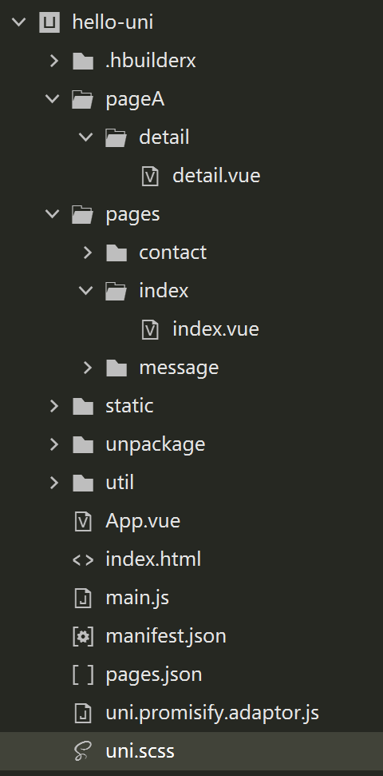
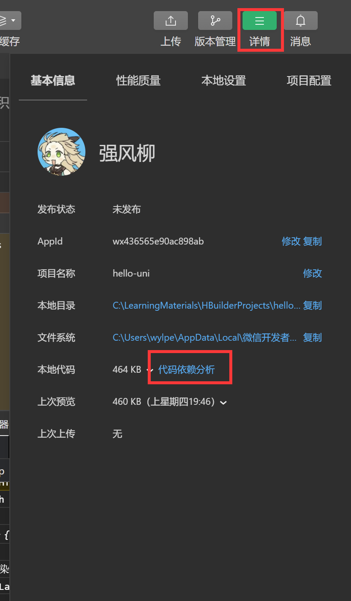

# uniapp

## 内置组件说明

### text组件

| 属性名      | 类型    | 默认值 | 说明         | 平台差异说明           |
| :---------- | :------ | :----- | :----------- | :--------------------- |
| selectable  | Boolean | false  | 文本是否可选 |                        |
| user-select | Boolean | false  | 文本是否可选 | 微信小程序             |
| space       | String  |        | 显示连续空格 | 钉钉小程序不支持       |
| decode      | Boolean | false  | 是否解码     | 百度、钉钉小程序不支持 |

**space 值说明**

| 值   | 说明                   |
| :--- | :--------------------- |
| ensp | 中文字符空格一半大小   |
| emsp | 中文字符空格大小       |
| nbsp | 根据字体设置的空格大小 |

selectable设定是否可选

```javascript
		<view>
			<text>详情</text>
		</view>
		<view>
			<text selectable>唱歌</text>
		</view>
```

### view组件

| 属性名                 | 类型    | 默认值 | 说明                                                         |
| :--------------------- | :------ | :----- | :----------------------------------------------------------- |
| hover-class            | String  | none   | 指定按下去的样式类。当 hover-class="none" 时，没有点击态效果 |
| hover-stop-propagation | Boolean | false  | 指定是否阻止本节点的祖先节点出现点击态，App、H5、支付宝小程序、百度小程序不支持（支付宝小程序、百度小程序文档中都有此属性，实测未支持） |
| hover-start-time       | Number  | 50     | 按住后多久出现点击态，单位毫秒                               |
| hover-stay-time        | Number  | 400    | 手指松开后点击态保留时间，单位毫秒                           |

```javascript
<template>
	<view>
		<view class="box2" hover-class="box2-active">
			<view class="box" :hover-start-time="1000" :hover-stay-time="1000" hover-class="box-active" hover-stop-propagation="">盒子</view>
		</view>
	</view>
</template>

<script>
</script>

<style lang="scss">
	.box2 {
		width: 200px;
		height: 200px;
		background: blue;
	}

	.box {
		width: 100px;
		height: 100px;
		background: darkgreen;
	}

	.box-active {
		background: red;
	}

	.box2-active {
		background: pink;
	}
</style>
```

### button组件

| 属性名   | 类型    | 默认值  | 说明                      | 平台差异说明                                             |
| :------- | :------ | :------ | :------------------------ | :------------------------------------------------------- |
| size     | String  | default | 按钮的大小                |                                                          |
| type     | String  | default | 按钮的样式类型            |                                                          |
| plain    | Boolean | false   | 按钮是否镂空，背景色透明  |                                                          |
| disabled | Boolean | false   | 是否禁用                  |                                                          |
| loading  | Boolean | false   | 名称前是否带 loading 图标 | H5、App(App-nvue 平台，在 ios 上为雪花，Android上为圆圈) |

```javascript
        <button>按钮</button>
        <button size="mini">按钮</button>
        <button type="primary">按钮</button>
        <button type="primary" plain> 按钮</button>
        <button type="primary" disabled>按钮</button>
        <button loading></button>
```

### image组件

| 属性名 | 类型   | 默认值        | 说明                 |
| :----- | :----- | :------------ | :------------------- |
| src    | String |               | 图片资源地址         |
| mode   | String | 'scaleToFill' | 图片裁剪、缩放的模式 |

#### mode 有效值

mode 有 14 种模式，其中 5 种是缩放模式，9 种是裁剪模式。

aspectFit为常用

| 模式 | 值           | 说明                                                         |
| :--- | :----------- | :----------------------------------------------------------- |
| 缩放 | scaleToFill  | 不保持纵横比缩放图片，使图片的宽高完全拉伸至填满 image 元素  |
| 缩放 | aspectFit    | 保持纵横比缩放图片，使图片的长边能完全显示出来。也就是说，可以完整地将图片显示出来。 |
| 缩放 | aspectFill   | 保持纵横比缩放图片，只保证图片的短边能完全显示出来。也就是说，图片通常只在水平或垂直方向是完整的，另一个方向将会发生截取。 |
| 缩放 | widthFix     | 宽度不变，高度自动变化，保持原图宽高比不变                   |
| 缩放 | heightFix    | 高度不变，宽度自动变化，保持原图宽高比不变 **App 和 H5 平台 HBuilderX 2.9.3+ 支持、微信小程序需要基础库 2.10.3** |
| 裁剪 | top          | 不缩放图片，只显示图片的顶部区域                             |
| 裁剪 | bottom       | 不缩放图片，只显示图片的底部区域                             |
| 裁剪 | center       | 不缩放图片，只显示图片的中间区域                             |
| 裁剪 | left         | 不缩放图片，只显示图片的左边区域                             |
| 裁剪 | right        | 不缩放图片，只显示图片的右边区域                             |
| 裁剪 | top left     | 不缩放图片，只显示图片的左上边区域                           |
| 裁剪 | top right    | 不缩放图片，只显示图片的右上边区域                           |
| 裁剪 | bottom left  | 不缩放图片，只显示图片的左下边区域                           |
| 裁剪 | bottom right | 不缩放图片，只显示图片的右下边区域                           |

```javascript
		<image src="https://t10.baidu.com/it/u=2696207298,454295397&fm=58"></image>
		<image src="https://t10.baidu.com/it/u=2696207298,454295397&fm=58" mode="aspectFit"></image>
		<image src="https://t10.baidu.com/it/u=2696207298,454295397&fm=58" mode="aspectFill"></image>
```

## 样式说明

#### 尺寸单位

`uni-app` 支持的通用 css 单位包括 px、rpx

- px 即屏幕像素
- rpx 即响应式 px，一种根据屏幕宽度自适应的动态单位。以 750 宽的屏幕为基准，750rpx 恰好为屏幕宽度。屏幕变宽，rpx 实际显示效果会等比放大，但在 App（vue2 不含 nvue） 端和 H5（vue2） 端屏幕宽度达到 960px 时，默认将按照 375px 的屏幕宽度进行计算，具体配置参考：[rpx 计算配置](https://uniapp.dcloud.net.cn/collocation/pages#globalstyle) 。

#### 选择器

目前支持的选择器有：

| 选择器           | 样例           | 样例描述                                       |
| :--------------- | :------------- | :--------------------------------------------- |
| .class           | .intro         | 选择所有拥有 class="intro" 的组件              |
| #id              | #firstname     | 选择拥有 id="firstname" 的组件                 |
| element          | view           | 选择所有 view 组件                             |
| element, element | view, checkbox | 选择所有文档的 view 组件和所有的 checkbox 组件 |
| ::after          | view::after    | 在 view 组件后边插入内容，**仅 vue 页面生效**  |
| ::before         | view::before   | 在 view 组件前边插入内容，**仅 vue 页面生效**  |

**注意：**

- 在 `uni-app` 中不能使用 `*` 选择器。
- 微信小程序自定义组件中仅支持 class 选择器
- `page` 相当于 `body` 节点，例如：

定义在 App.vue 中的样式为全局样式，作用于每一个页面。在 pages 目录下 的 vue 文件中定义的样式为局部样式，只作用在对应的页面，并会覆盖 App.vue 中相同的选择器。

**注意：**

- App.vue 中通过 `@import` 语句可以导入外联样式，一样作用于每一个页面。

- nvue 页面暂不支持全局样式

#### 背景图片

  `uni-app` 支持使用在 css 里设置背景图片，使用方式与普通 `web` 项目大体相同，但需要注意以下几点：

  - 支持 base64 格式图片。

  - 支持网络路径图片。

  - 小程序不支持在 css 中使用本地文件，包括本地的背景图和字体文件。需以 base64 方式方可使用。

  - 使用本地路径背景图片需注意：

    1. 为方便开发者，在背景图片小于 40kb 时，`uni-app` 编译到不支持本地背景图的平台时，会自动将其转化为 base64 格式；
    2. 图片大于等于 40kb，会有性能问题，不建议使用太大的背景图，如开发者必须使用，则需自己将其转换为 base64 格式使用，或将其挪到服务器上，从网络地址引用。
    3. 本地背景图片的引用路径推荐使用以 ~@ 开头的绝对路径。

    ```css
    .test2 {
    	background-image: url('~@/static/logo.png');
    }
    ```

    复制代码

  **注意**

  - 微信小程序不支持相对路径（真机不支持，开发工具支持）

## 页面生命周期

`uni-app` 页面除支持 Vue 组件生命周期外还支持下方页面生命周期函数，当以组合式 API 使用时，在 Vue2 和 Vue3 中存在一定区别，请分别参考：[Vue2 组合式 API 使用文档](https://uniapp.dcloud.net.cn/tutorial/vue-composition-api.html) 和 [Vue3 组合式 API 使用文档](https://uniapp.dcloud.net.cn/tutorial/vue3-composition-api.html)。

| 函数名                              | 说明                                                         | 平台差异说明                                                 | 最低版本 |
| :---------------------------------- | :----------------------------------------------------------- | :----------------------------------------------------------- | :------- |
| onInit                              | 监听页面初始化，其参数同 onLoad 参数，为上个页面传递的数据，参数类型为 Object（用于页面传参），触发时机早于 onLoad | 百度小程序                                                   | 3.1.0+   |
| onLoad                              | 监听页面加载，该钩子被调用时，响应式数据、计算属性、方法、侦听器、props、slots 已设置完成，其参数为上个页面传递的数据，参数类型为 Object（用于页面传参），参考[示例](https://uniapp.dcloud.net.cn/api/router#navigateto)。 |                                                              |          |
| onShow                              | 监听页面显示，页面每次出现在屏幕上都触发，包括从下级页面点返回露出当前页面 |                                                              |          |
| onReady                             | 监听页面初次渲染完成，此时组件已挂载完成，DOM 树($el)已可用，注意如果渲染速度快，会在页面进入动画完成前触发 |                                                              |          |
| onHide                              | 监听页面隐藏                                                 |                                                              |          |
| onUnload                            | 监听页面卸载                                                 |                                                              |          |
| onResize                            | 监听窗口尺寸变化                                             | App、微信小程序、快手小程序                                  |          |
| onPullDownRefresh                   | 监听用户下拉动作，一般用于下拉刷新，参考[示例](https://uniapp.dcloud.net.cn/api/ui/pulldown) |                                                              |          |
| onReachBottom                       | 页面滚动到底部的事件（不是scroll-view滚到底），常用于下拉下一页数据。具体见下方注意事项 |                                                              |          |
| onTabItemTap                        | 点击 tab 时触发，参数为Object，具体见下方注意事项            | 微信小程序、QQ小程序、支付宝小程序、百度小程序、H5、App、快手小程序、京东小程序 |          |
| onShareAppMessage                   | 用户点击右上角分享                                           | 微信小程序、QQ小程序、支付宝小程序、抖音小程序、飞书小程序、快手小程序、京东小程序 |          |
| onPageScroll                        | 监听页面滚动，参数为Object                                   | nvue不支持                                                   |          |
| onNavigationBarButtonTap            | 监听原生标题栏按钮点击事件，参数为Object                     | App、H5                                                      |          |
| onBackPress                         | 监听页面返回，返回 event = {from:backbutton、 navigateBack} ，backbutton 表示来源是左上角返回按钮或 android 返回键；navigateBack表示来源是 uni.navigateBack；[详见](https://uniapp.dcloud.net.cn/tutorial/page.html#onbackpress) | app、H5、支付宝小程序                                        |          |
| onNavigationBarSearchInputChanged   | 监听原生标题栏搜索输入框输入内容变化事件                     | App、H5                                                      | 1.6.0    |
| onNavigationBarSearchInputConfirmed | 监听原生标题栏搜索输入框搜索事件，用户点击软键盘上的“搜索”按钮时触发。 | App、H5                                                      | 1.6.0    |
| onNavigationBarSearchInputClicked   | 监听原生标题栏搜索输入框点击事件（pages.json 中的 searchInput 配置 disabled 为 true 时才会触发） | App、H5                                                      | 1.6.0    |
| onShareTimeline                     | 监听用户点击右上角转发到朋友圈                               | 微信小程序                                                   | 2.8.1+   |
| onAddToFavorites                    | 监听用户点击右上角收藏                                       | 微信小程序、QQ小程序                                         | 2.8.1+   |

Vue2

```javascript
	export default {
		data() {
			return {
				title: 'Hello'
			}
		},
		onLoad(params) {
			console.log('页面加载', params)
		},
		onShow() {
			console.log('页面显示');
		},
		onReady(){
			console.log('页面初次渲染完成');
		},
		onHide(){
			console.log('页面隐藏');
		},
		onPullDownRefresh(){
			console.log('触发下拉');
			uni.stopPullDownRefresh();
		},
		methods: {

		}
	}
```

Vu3

```javascript
import { onLoad} from '@dcloudio/uni-app';
onLoad((params)=>{
    console.log(params);
});
```

## 下拉刷新

```javascript
<template>
	<view class="content">
		<button @click="fun">刷新</button>
	</view>
</template>

<script>
	export default {
		data() {
			return {
				title: 'Hello'
			}
		},
		onPullDownRefresh() {
			console.log('触发下拉');
			setTimeout(() => {
				uni.stopPullDownRefresh();
			}, 2000)

		},
		methods: {
			fun() {
				console.log(1);
				uni.startPullDownRefresh()
			}
		}
	}
</script>
```

## 页面触底事件

```javascript
		onReachBottom(){
			console.log('页面触底');
		},
```

pages.json中可配置检测页面触底的

	"globalStyle": {
		// 判断页面是否触底默认单位px
		"onReachBottomDistance": 100
	},

## 网络请求

### uni.request(OBJECT)

发起网络请求。

> 在各个小程序平台运行时，网络相关的 API 在使用前需要配置域名白名单。

**OBJECT 参数说明**

| 参数名               | 类型                      | 必填 | 默认值 | 说明                                                         | 平台差异说明                                                 |
| :------------------- | :------------------------ | :--- | :----- | :----------------------------------------------------------- | :----------------------------------------------------------- |
| url                  | String                    | 是   |        | 开发者服务器接口地址                                         |                                                              |
| data                 | Object/String/ArrayBuffer | 否   |        | 请求的参数                                                   | App 3.3.7 以下不支持 ArrayBuffer 类型                        |
| header               | Object                    | 否   |        | 设置请求的 header，header 中不能设置 Referer                 | App、H5端会自动带上cookie，且H5端不可手动修改                |
| method               | String                    | 否   | GET    | 有效值详见下方说明                                           |                                                              |
| timeout              | Number                    | 否   | 60000  | 超时时间，单位 ms                                            | H5(HBuilderX 2.9.9+)、APP(HBuilderX 2.9.9+)、微信小程序（2.10.0）、支付宝小程序 |
| dataType             | String                    | 否   | json   | 如果设为 json，会对返回的数据进行一次 JSON.parse，非 json 不会进行 JSON.parse |                                                              |
| responseType         | String                    | 否   | text   | 设置响应的数据类型。合法值：text、arraybuffer                | 支付宝小程序不支持                                           |
| sslVerify            | Boolean                   | 否   | true   | 验证 ssl 证书                                                | 仅App安卓端支持（HBuilderX 2.3.3+），不支持离线打包          |
| withCredentials      | Boolean                   | 否   | false  | 跨域请求时是否携带凭证（cookies）                            | 仅H5支持（HBuilderX 2.6.15+）                                |
| firstIpv4            | Boolean                   | 否   | false  | DNS解析时优先使用ipv4                                        | 仅 App-Android 支持 (HBuilderX 2.8.0+)                       |
| enableHttp2          | Boolean                   | 否   | false  | 开启 http2                                                   | 微信小程序                                                   |
| enableQuic           | Boolean                   | 否   | false  | 开启 quic                                                    | 微信小程序                                                   |
| enableCache          | Boolean                   | 否   | false  | 开启 cache                                                   | 微信小程序、抖音小程序 2.31.0+                               |
| enableHttpDNS        | Boolean                   | 否   | false  | 是否开启 HttpDNS 服务。如开启，需要同时填入 httpDNSServiceId 。 HttpDNS 用法详见 [移动解析HttpDNS](https://developers.weixin.qq.com/miniprogram/dev/framework/ability/HTTPDNS.html) | 微信小程序                                                   |
| httpDNSServiceId     | String                    | 否   |        | HttpDNS 服务商 Id。 HttpDNS 用法详见 [移动解析HttpDNS](https://developers.weixin.qq.com/miniprogram/dev/framework/ability/HTTPDNS.html) | 微信小程序                                                   |
| enableChunked        | Boolean                   | 否   | false  | 开启 transfer-encoding chunked                               | 微信小程序                                                   |
| forceCellularNetwork | Boolean                   | 否   | false  | wifi下使用移动网络发送请求                                   | 微信小程序                                                   |
| enableCookie         | Boolean                   | 否   | false  | 开启后可在headers中编辑cookie                                | 支付宝小程序 10.2.33+                                        |
| cloudCache           | Object/Boolean            | 否   | false  | 是否开启云加速（详见[云加速服务](https://smartprogram.baidu.com/docs/develop/extended/component-codeless/cloud-speed/introduction/)） | 百度小程序 3.310.11+                                         |
| defer                | Boolean                   | 否   | false  | 控制当前请求是否延时至首屏内容渲染后发送                     | 百度小程序 3.310.11+                                         |
| success              | Function                  | 否   |        | 收到开发者服务器成功返回的回调函数                           |                                                              |
| fail                 | Function                  | 否   |        | 接口调用失败的回调函数                                       |                                                              |
| complete             | Function                  | 否   |        | 接口调用结束的回调函数（调用成功、失败都会执行）             |                                                              |

## 数据缓存

异步设置

```javascript
	function set() {
		uni.setStorage({
			key: 'abc',
			data: {
				name: 'jack',
				age: 20
			}
		})
	}

	function getUserStorage() {
		uni.getStorage({
			key: 'abc',
			success(data) {
				console.log(data);
			}
		})
	}

	function delUserStorage() {
		uni.removeStorage({
			key: 'abc'
		});
		// uni.clearStorage();
	}
```

同步设置

```javascript
		setStorage() {
			uni.setStorageSync('id', 100)
		},
		getStorage() {
			const res = uni.getStorageSync('id');
			console.log(res);
		},
		removeStorage() {
			uni.removeStorageSync('id')
		},
```

## 图片上传与预览

```javascript
<template>
	<view>
		<text>hello-uni</text>
		<button>上传</button>
		<button @click="chooseImg()">上传图片</button>
		<image v-for="item in imgArr" :src="item" :key="item" @click="previewImg(item)"></image>
	</view>
</template>

<script>
	export default {
		data() {
			return {
				imgArr: []
			}
		},
		methods: {
			chooseImg() {
				uni.chooseImage({
					count: 5,
					success: (res) => {
						console.log(res, '成功');
						this.imgArr = res.tempFilePaths
					}
				})
				console.log(1);
			},
			previewImg(current) {
				console.log(current);
				uni.previewImage({
					current,
					urls: this.imgArr,
				});
			}
		}
	}
</script>

<style></style>
```

## 条件编译实现跨端兼容

```javascript
<template>
	<view>
		<text>hello-uni</text>
		<button>上传</button>
		<button @click="chooseImg()">上传图片</button>
		<image v-for="item in imgArr" :src="item" :key="item" @click="previewImg(item)"></image>
		<!-- #ifdef H5 -->
		<view>我希望只在h5页面中看见</view>
		<!-- #endif -->
		<!-- #ifdef MP-WEIXIN -->
		<view>我希望只在小程序页面中看见</view>
		<!-- #endif -->
		<view class="test">测试</view>
	</view>
</template>

<script>
	export default {
		data() {
			return {
				imgArr: []
			}
		},
		onLoad() {
			// #ifdef H5
			console.log('H5');
			// #endif
			// #ifdef MP-WEIXIN
			console.log('WX');
			// #endif
		},
		methods: {
			chooseImg() {
				uni.chooseImage({
					count: 5,
					success: (res) => {
						console.log(res, '成功');
						this.imgArr = res.tempFilePaths
					}
				})
				console.log(1);
			},
			previewImg(current) {
				console.log(current);
				uni.previewImage({
					current,
					urls: this.imgArr,
				});
			}
		}
	}
</script>

<style>
	/* #ifdef H5 */
	.test {
		color: pink;
	}

	/* #endif */
	/* #ifdef MP-WEIXIN */
	.test {
		color: blue;
	}

	/* #endif */
</style>
```

## 导航跳转和传参

- redirect方式会销毁当前页然后跳转
- navigate方式不会销毁当前页
- switchTab会销毁所有非tab页面

```javascript
<template>
	<view class="content">
		<view>
			<up-button type="primary" text="确定"></up-button>
			<text>路由</text>
			<navigator open-type="navigate" url="/pages/home/Home?name=jack">Home</navigator>
			<navigator open-type="redirect" url="/pages/home/Home?name=jack">RHome</navigator>
			<button @click="to()">home</button>
			<navigator open-type="switchTab" url="/pages/about/About">About</navigator>
			<button @click="switchTabAction()">About</button>
		</view>
	</view>
</template>

<script setup>

import { onLoad, onShow, onReady } from '@dcloudio/uni-app'

console.log(uni.$u.config.v);
const title = 'Hello';

onLoad(() => {
	console.log('index onLoad');
});
onShow(() => {
	console.log('index onShow');
});
onReady(() => {
	console.log('index onReady');
});
function to() {
	uni.redirectTo({
		url: '/pages/home/Home',
		success: () => {
			console.log('success');
		}
	})
	// uni.navigateTo({
	// 	url:'/pages/home/Home',
	// 	success:()=>{
	// 		console.log('success');
	// 	}
	// })
}
function switchTabAction() {
	uni.switchTab({
		url: '/pages/about/About'
	})
}
</script>
```


## 跨组件通信方式

### uni.$emit(eventName,OBJECT)

触发全局的自定义事件，附加参数都会传给监听器回调函数。

| 属性      | 类型   | 描述                   |
| --------- | ------ | ---------------------- |
| eventName | String | 事件名                 |
| OBJECT    | Object | 触发事件携带的附加参数 |

**代码示例**

```javascript
	uni.$emit('update',{msg:'页面更新'})
```

### uni.$on(eventName,callback)

监听全局的自定义事件，事件由 `uni.$emit` 触发，回调函数会接收事件触发函数的传入参数。

| 属性      | 类型     | 描述           |
| --------- | -------- | -------------- |
| eventName | String   | 事件名         |
| callback  | Function | 事件的回调函数 |

**代码示例**

```javascript
	uni.$on('update',function(data){
		console.log('监听到事件来自 update ，携带参数 msg 为：' + data.msg);
	})
```

## map组件的使用

```javascript
<template>
	<view>
		<view>联系我们</view>
		<button @click="startReq">发起请求</button>
		<map class="map" :longitude="longitude" :latitude="latitude" :scale="scale" :markers="markers"></map>
	</view>
</template>

<script>
	export default {
		data() {
			return {

				longitude: 118.748237,
				latitude: 32.226208,
				scale: 13,
				markers: [{
					longitude: 118.748237,
					latitude: 32.226208,
					iconPath: '/static/logo.png',
					width: 30,
					height: 30
				}]
			}
		},
		methods: {
			async startReq() {
				console.log(this.$myRequest);
				const res = await this.$myRequest({
					url: '/RecommendationInfo'
				});
				console.log(res);
			}
		}
	}
</script>

<style>
	.map {
		width: 750rpx;
		height: 750rpx;
	}
</style>
```

## 拨打电话

```javascript
				uni.makePhoneCall({
					phoneNumber:'13814194299'
				})
```

## 轮播组件

```javascript
			<swiper :indicator-dots="true" :autoplay="true" :interval="3000" :duration="1000" :circular="true">
				<swiper-item v-for="(v,i) of imgArr" :key="i">
					<image :src="v"></image>
				</swiper-item>
			</swiper>
```

### swiper

滑块视图容器。

一般用于左右滑动或上下滑动，比如banner轮播图。

注意滑动切换和滚动的区别，滑动切换是一屏一屏的切换。swiper下的每个swiper-item是一个滑动切换区域，不能停留在2个滑动区域之间。

**属性说明**

| 属性名                 | 类型    | 默认值            | 说明                                                         | 平台差异说明       |
| :--------------------- | :------ | :---------------- | :----------------------------------------------------------- | :----------------- |
| indicator-dots         | Boolean | false             | 是否显示面板指示点                                           |                    |
| indicator-color        | Color   | rgba(0, 0, 0, .3) | 指示点颜色                                                   |                    |
| indicator-active-color | Color   | #000000           | 当前选中的指示点颜色                                         |                    |
| active-class           | String  |                   | swiper-item 可见时的 class                                   | 支付宝小程序       |
| changing-class         | String  |                   | acceleration 设置为 true 时且处于滑动过程中，中间若干屏处于可见时的class | 支付宝小程序       |
| autoplay               | Boolean | false             | 是否自动切换                                                 |                    |
| current                | Number  | 0                 | 当前所在滑块的 index                                         |                    |
| current-item-id        | String  |                   | 当前所在滑块的 item-id ，不能与 current 被同时指定           | 支付宝小程序不支持 |
| interval               | Number  | 5000              | 自动切换时间间隔                                             |                    |
| duration               | Number  | 500               | 滑动动画时长                                                 | app-nvue不支持     |

## uniapp分包

manifest.json文件中

为mp-weixin字段添加如下属性

```javascript
	"mp-weixin": {
		"optimization": {
			"subPackages": true
		}
	},
```

pages.json文件中

>在pages.json中新建数组"subPackages"，数组中包含两个参数：
>
>1.root：为子包的根目录，
>
>2.pages：子包由哪些页面组成，参数同pages；

```javascript
	"subPackages": [{
		"root": "pageA",
        // 包名根目录
		"pages": [{
			"path": "detail/detail"
            // 根目录下的路径
		}]
	}],
```

项目结构展示



查看分包情况


